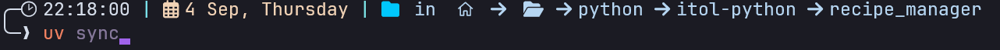
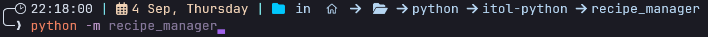
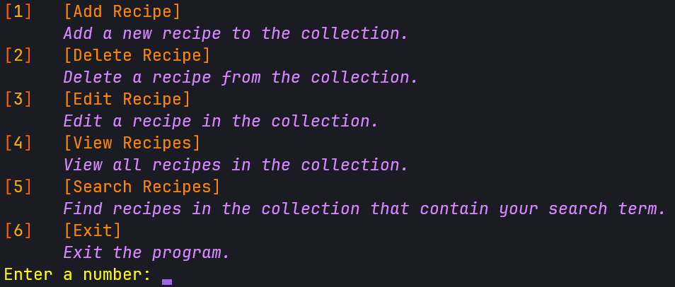
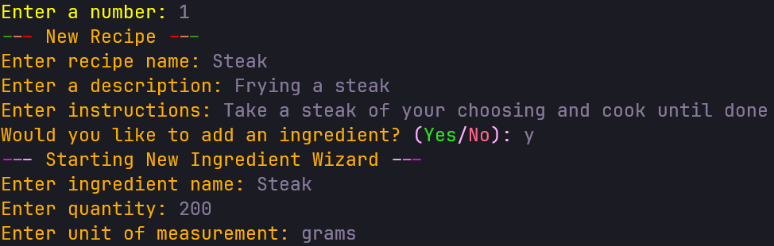
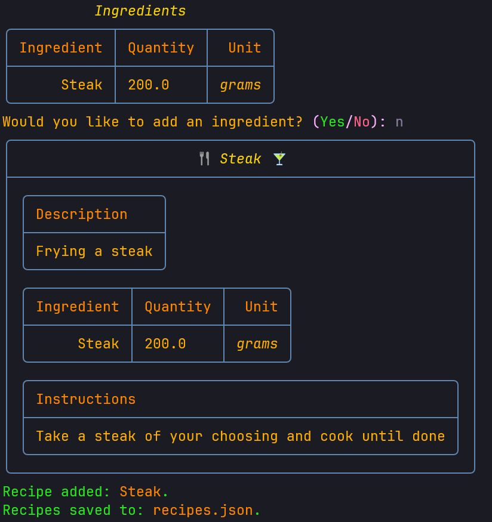

# Recipe Manager

a CLI utility to manage recipes.

-----

## Table of Contents

  - [About](#about)
  - [Installation](#installation--usage)
  - [Code Example](#example)

-----

## About

A CLI utility to manage recipes. The functions are:
  - add recipe
  - delete recipe
  - edit recipe
  - view all recipes
  - search contents of recipes


-----

## Installation & Usage

Instructions on how to install and set up this program.
UV was used to set up the python project, please find the documentation here: [UV](https://docs.astral.sh/uv/)

To be able to use this project you must install UV: [installing UV](https://docs.astral.sh/uv/getting-started/installation/)

```bash
# Example for a simple installation
pip install uv
```

Then git clone the project, and run:



```bash
uv sync
```

In the root of the recipe manager project, which should be the initial `recipe_manager` folder.

Then run the following command to run the python package from the same folder:



```bash
python -m recipe_manager
```

-----

## Example

Upon starting the program:



Choose a number and the program will guide you through the various processes:





Once this has been input, the program will show you what you have added:



Other functionality works in a similar way.

-----
